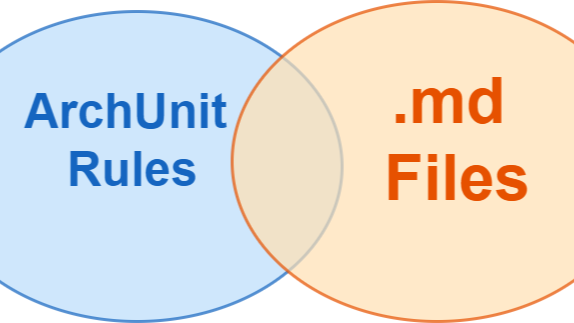
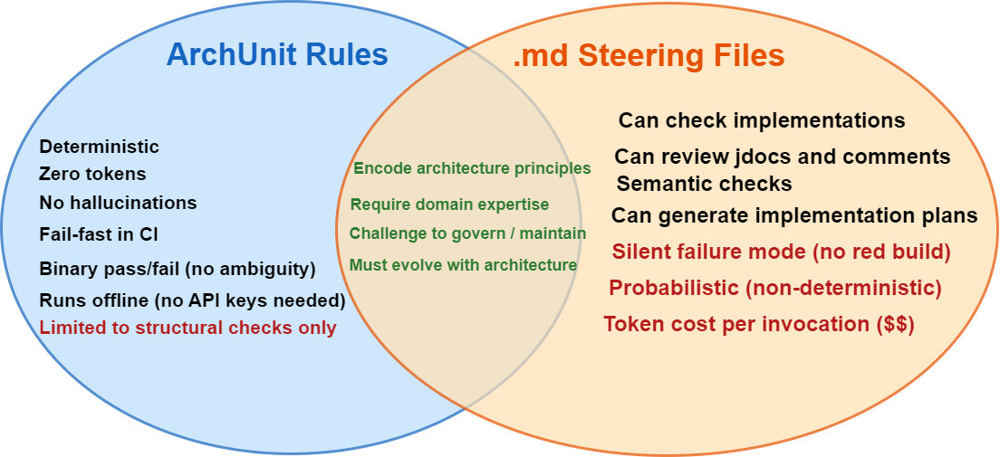

# Compare & Contrast ArchUnit and AI Coding Tool steering .md files

  

With the entire planet talking about AI Coding Tools, there's a lot of chat about .md files and how they need to include architectural and design principles so that the AI Coding Tool will generate better code that sticks to architecture — meaning you have a better chance of keeping your software healthy while you pick up the pace with velocity and delivery. But wait a sec, there already are tools where you specify design and architectural rules? Let's take Java as an example, such a tool is: ArchUnit. So what's the difference between how you define these rules and principles in your ArchUnit vis a vi a .md file? Obviously, ArchUnit is more at the verification or CI stage rather than the generation stage. But, they still include the same architectural principles right?

  

## ArchUnits v .md Files

In AI Architecture, so many things can be expressed as .md files: agents, skills, steering files — it's a long list, with slightly different interpretations. So to be clear, in this post I am talking about steering .md files here. The .md files where you put the design and architecture information that skills and agents can then use and re-use as they so wish.

## Similarities

Steering .md files have four things in common with ArchUnits:

- They both encode architectural principles
- They both require domain expertise
- They are difficult to govern
- They must evolve with the architecture — go stale, they become useless

## ArchUnit Differentiators

- **ArchUnit is deterministic.** Just like a compiler or a unit test. Everything is predictable and not subject to whims or subjective interpretations.
- **ArchUnit has no AI Coding Tool token cost.** Interesting when there is more and more discussion about token usage across different token models — ArchUnit costs zero tokens.
- **ArchUnit fails fast** — just like a unit test. You find out quickly.
- **Everything is black or white.** There is no "might be ok" or "may not be ok". It's either pass or fail.
- **They run offline** and don't even need an internet connection or API keys.

## .md Steering File Differentiators

- While ArchUnit can check code structure, classes, methods, and packages — it cannot check the internals of a method. For example, imagine you had steering that stipulated when lots of setters were being called on business layer entities it could be indicative that a business layer library method wasn't being called, meaning code was being unnecessarily bloated. This means you can help the AI Coding Tool detect code bloat and do something about it.
- AI Coding Tools can interpret any text. So you can add steering to check that key classes and interfaces in packages include very good Javadoc. Ask the AI Coding Tool to interpret the Javadoc and assess its understandability to a developer who will be relying on it.
- AI Coding Tools can semantically interpret anything. So you can include something like: "be strict on SOLID principles". It's non-deterministic how strict it will be, but at least you can say it.
- AI Coding Tools and steering files can be used to suggest fixes and code changes. ArchUnit only tells you what fails and, if well written, can provide a decent error message — but that's it.

## How to Use Both

Good ArchUnits and good .md files are a powerful combination. ArchUnit Rules are architecture as executable code; .md files are architecture as contextual knowledge. Where the .md file provides interpretive guidance, the ArchUnit is a set of enforceable rules.

They can be organised to mirror each other. So let's say you have 15 ArchUnit rules in a class called `APIValidationsArchRules` to check the data validation in your API layer is sticking to described patterns — you can have a corresponding steering file: `API-Validation.md` with sections covering the same technical area. This makes it easy to see what is covered by .md guidance and what is enforced by ArchUnit rules. You can take things out of the .md file that you are happy to cover in ArchUnit, meaning your .md files become smaller, more manageable, and the steering file is less likely to blow the context window.

## Agent-Assisted Feedback Loops

You can also create agents that run ArchUnit rules during the agent's own verification phase. The agent can not only run the ArchUnits but will also have the ability to read your really good error message from your well-written ArchUnits, figure out what's wrong, and then attempt to fix it. If it's an obvious coding error the agent won't need human input; if it appears the ArchUnit may need to evolve or the agent is unsure, it can stop and ask for human input.

## Which is Harder to Write?

This one is possibly subjective. But AI Coding Tools + .md files are:

- Non-deterministic
- Not schematic
- Able to end up burning a context window and failing silently

So for me, they are harder to write. You don't need multiple sub-agents looking at separate .md files, compacting results and sending information to each other. But obviously, as this article shows, you can do many things an ArchUnit can never do. But this still begs the question: should engineers, architects, and organisations try to master ArchUnits first and then move onto .md files? Or go straight to .md files and at some point in the future realise that half of it could have been in a deterministic, zero-token-consuming ArchUnit?

## Conclusion

AI steering files shouldn't replace architecture tests of any form. They should complement them. Steering files guide generation, while ArchUnit enforces compliance.
