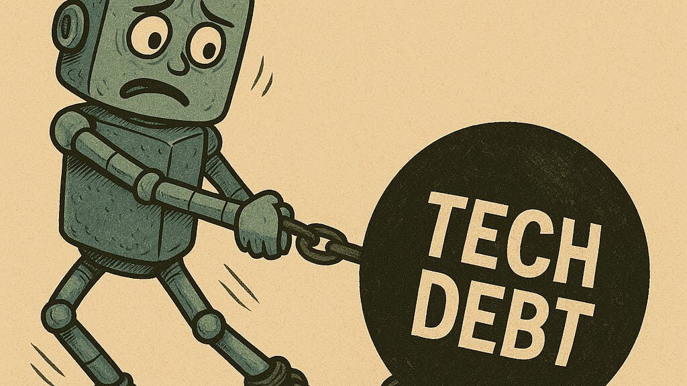

# Indicating Your Design Debt (AI LLM in the SDLC — Part 2)

<p align="center">
  
</p>

This post explains how I am currently trying to indicate to the AI LLM what they are looking at is design debt, and how to steer them away from it. I am using the term **design debt** as opposed to *technical debt* to indicate the debt is more structural in nature, and hence more likely to really confuse an AI LLM. That means I am not talking about trivial things like typos in Javadoc, extra blank lines, or anything you could fix with simple linting. Instead, design debt means things that would usually take more time to fix.

Just to be clear — in 25+ years of working with software, I have never experienced any system that doesn't have its fair share of design debt. I've seen it, introduced it, fixed it, prevented it, fought with it, worked around it, missed it, got sick over it, wept over it — you name it, the war wounds are there.

## The Problem

Let's work through an example of design debt that can very easily adversely impact AI in the SDLC.

Imagine you want to write a new API. The AI LLM sees existing API code and introspects it to figure out the code it should write for your new API. Naturally, it will try to stick to the existing approach. The problem is, the code nearby can be really good guidance in one aspect but really confuse the AI in another.

So you might steer the AI to ignore the `/payment` API and use the `/teams` API instead. Problem is, while the `/teams` API doesn't have the same design debt as the `/payment` API, it has its own *different* design debt. Each API's debt on its own isn't enough to justify a full refactor, but the cumulative design debt makes the AI's job much harder — it doesn't matter what the model is.

In situations like this, you can end up with:

- AI just taking the debt from `/payments`
- AI just taking the debt from `/teams`
- AI picking the bad part of the `/payments` endpoint *and* the bad part of the `/teams` endpoint — double debt

It's rare that the AI will take the good parts of both and produce what you actually want. Humans are still a lot better at reasoning about ambiguity and inconsistency in code than AI. It's very rare the AI can figure out exactly what the specific design debt is in both places and arrive at the right answer for your next API.

## What I Did About It

I created a simple annotation:

```java
public @interface KnownApiDesignDebt {

    /**
     * The JIRA ticket tracking the fix for this defect. Required.
     * @return the JIRA key, e.g. "BLIP-6"
     */
    String jira();

    String comment();
}
```

Now I can annotate the design debt in the `/payment` solution and the design debt in the `/teams` solution:

```java
@KnownApiDesignDebt(
    jira = "BLIP-7",
    comment = "semantic version pattern broken, should only be using SemanticService not separate services"
)
public class PaymentController {
    // ...
}
```

```java
@KnownApiDesignDebt(
    jira = "BLIP-8",
    comment = "optimistic locking pattern incorrectly applied, won't scale for queries. Use @OptimisticLock and Version interfaces."
)
public class TeamsController {
    // ...
}
```

Then, in the `.md` file that steers the AI, I add a few short lines:

> ### Understanding `@KnownApiDesignDebt`
>
> When reading source files, you may encounter classes or methods annotated with `@KnownApiDesignDebt`. This annotation signals **known, accepted technical debt** in a specific aspect of the class — **not that the entire class, package, or solution is wrong**. For more information on the specific debt, read the comment on the annotation and/or check the JIRA.

And that's it — we start getting better performance from the AI because it can reason better.

## Why This Matters

Before the AI world, organizations survived the pain of tech debt by leveraging institutional knowledge. Knowledge like:

> "Yeah, don't copy that controller, it predates our versioning strategy."

...lived in:

- people's heads
- architecture meetings
- Jira comments
- tribal knowledge

With this approach, the AI has explicit context that previously existed only as tribal knowledge. Instead of treating every nearby implementation as equally valid, it can distinguish between reference implementations and known architectural exceptions.
